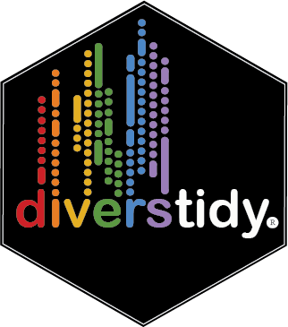
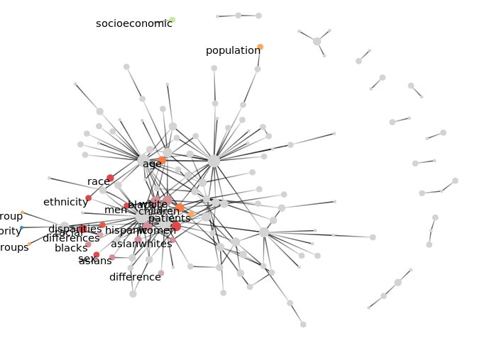
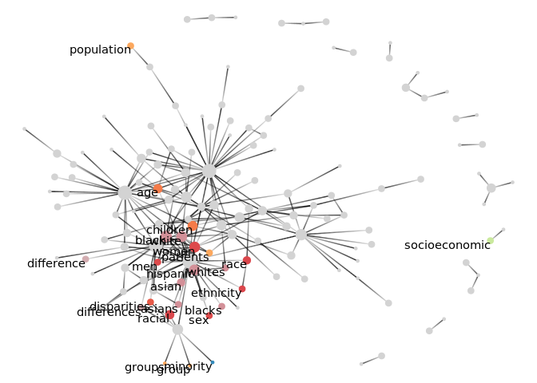

# diverstidy: A tidy package for detection and standardization of geographic, population, and diversity-related terminology in unstructured text data 

**Authors:** [Brandon Kramer](https://www.brandonleekramer.com/)<br/>
**License:** [MIT](https://opensource.org/licenses/MIT)<br/>

<!-- badges: start -->

<!--[](https://github.com/brandonleekramer/diverstidy/actions) -->

<!-- badges: end -->

### Installation

You can install this package using the `devtools` package:

``` r
install.packages("devtools")
devtools::install_github("brandonleekramer/diverstidy") 
```

The `diverstidy` package provides several functions that help detect
patterns in unstandardized text data for analyses of geographies,
populations, other forms of diversity. Currently, there are 17 different
functions that detect terms across the following subdomains of
diversity-related research: ancestry, culture, disability,
discrimination, diversity, equity, inclusion, linguistic, migration,
population, race/ethnicity, religious, sex/gender, sexuality, social
class, and US OMB population terms. Although somewhat simple, the
intuition behind these functions is to detect the quantity of
diversity-related terms show up in a given text entry. To do this, each
function depends on a curated dictionary of terms that fall under these
17 domains of topics, which can be called using the
`data(diversity_dictionary)` function. There are a number of case
studies, but the primary uses of these functions are to examine
historical trends in term usage and/or to detect potential biases in
text.

### Standardizing countries and continents with `detect_geographies()`

Imagine that you just scraped a bunch of data from a social media like
Twitter or code hosting platform like GitHub. You want to find out where
the users’ information is coming from, but only have messy text data
where users write they currently live. You could develop some regex to
catch these countries, but this is incredibly time consuming to develop
and regex can run very slow when matching over large text corpora.
`detect_geographies()` is capable of not only detecting and
standardizing messy text data into countries, but also includes data on
more than 35,000 cities to maximize the accuracy of the detection
process. Moreover, it uses a “funnel matchings” technique that makes the
progress goes much faster (currently \~40 mins for 3 million entries).
You can choose to recode your desired outcome to countries, continents,
a number of regions defined by the United Nations, country names in
seven different languages, and cute little emoji flags\! If you need the
flexibility of `detect_geographies()` but a different country coding
scheme, check out the
[`countrycode`](https://github.com/vincentarelbundock/countrycode)
package for \~40 different options.

``` r
library(tidyverse)
library(tidyorgs)
library(diverstidy)
data(github_users)
```

``` r
github_users %>%
  detect_geographies(login, location, "country", email) %>% 
  detect_geographies(login, country, "iso_2") %>% 
  detect_geographies(login, country, "flag") %>% 
  select(login, location, country, iso_2, flag)
```

    ## # A tibble: 460 × 5
    ##    login        location                  country        iso_2 flag 
    ##    <chr>        <chr>                     <chr>          <chr> <chr>
    ##  1 mcollina     In the clouds above Italy Italy          IT    🇮🇹   
    ##  2 geoffeg      St. Louis, MO             United States  US    🇺🇸   
    ##  3 diegopacheco Porto Alegre, RS - Brazil Brazil         BR    🇧🇷   
    ##  4 ephur        San Antonio, TX           United States  US    🇺🇸   
    ##  5 paneq        Poland, Wrocaw            Poland         PL    🇵🇱   
    ##  6 michaeljones Manchester, UK            United Kingdom GB    🇬🇧   
    ##  7 wjimenez5271 Sunnyvale, CA             United States  US    🇺🇸   
    ##  8 simongog     Karlsruhe                 Germany        DE    🇩🇪   
    ##  9 dalpo        Vicenza, Italy            Italy          IT    🇮🇹   
    ## 10 shouze       Marseille, France         France         FR    🇫🇷   
    ## # … with 450 more rows

### Analyzing historical trends with `detect_*_terms()`

These functions help users quickly analyze changes in terms over time
using one of the seventeen dictionaries available on diversity-related
topics. In essence, the functions rely on curated dictionaries with
dozens of terms in each category. You can simply use the functions from
each category to detect how many terms relating to sex/gender or
race/ethnicity show up in the text and then summarize to see how they
change over time. These functions could also be used to examine
diversity-related trends in social media profiles like Twitter or
LinkedIn.

``` r
library(tidyverse)
library(diverstidy)
data(pubmed_data)
```

``` r
pubmed_data %>%
  detect_racialethnic_terms(fk_pmid, abstract) %>%
  detect_sexgender_terms(fk_pmid, abstract) %>% 
  detect_socialclass_terms(fk_pmid, abstract) %>% 
  group_by(year) %>% 
  summarize(racial_ethnic = sum(racial_ethnic),
            sex_gender = sum(sex_gender),
            social_class = sum(social_class)) %>% 
  pivot_longer(!year, names_to = "category", values_to = "count") %>% 
  ggplot(aes(x=year, y=count, group=category)) +
  geom_line(aes(color=category), size = 1) +
  ggtitle("Change in Diversity-Related Terms Over Time") + theme_bw() 
```



### Examining relationships between diversity terminology within texts

Sociologists are usually taught early on in their graduate careers that
“sex/gender is relational.” Here, you can combine the `diverstidy`
package with `tidytext` and `tidygraph` to make text networks that help
reveal how sex/gender and other forms of diversity relate to other
concepts in unstandardized text data. Here is a preliminary example that
shows how population terms tend to cluster together in biomedical
abstracts.

``` r
library(tidyverse)
library(diverstidy)
library(tidytext)
library(igraph)
library(ggraph)
library(tidygraph)
data(pubmed_data)
data(diversity_dictionary)
```

``` r
# create an edgelist of all terms mentioned more than 100 times together 
pubmed_graph <- pubmed_data %>%
  unnest_tokens(bigram, abstract, token = "ngrams", n = 2) %>%
  separate(bigram, c("word1", "word2"), sep = " ") %>% 
  count(word1, word2, sort = TRUE) %>%
  filter(n > 100) %>%
  graph_from_data_frame() 

# pull out the nodelist from that graph 
nodelist <- data.frame(id = c(1:(igraph::vcount(pubmed_graph))), 
                       name = igraph::V(pubmed_graph)$name)
# and join category data to all our diversity terms 
dictionary_terms <- diversity_dictionary %>% 
  unnest_legacy(name = strsplit(catch_terms, "\\|")) %>% 
  select(name, category)
nodelist <- nodelist %>% 
  left_join(dictionary_terms, by = "name") %>% 
  mutate(category = replace_na(category, "nothing"),
         category = str_replace(category, "race/ethnicity\\|us omb terms", "us omb terms"))
V(pubmed_graph)$category <- nodelist$category

# create a custom color palette and vector to only visualize certain words 
custom_colors <- colorRampPalette(c("#D3D3D3", RColorBrewer::brewer.pal(9, 'Spectral')))
graph_tbl <- pubmed_graph %>% 
  as_tbl_graph() %>% 
  activate(nodes) %>% 
  mutate(degree  = centrality_degree()) %>% 
  mutate(new_name = ifelse(str_detect(
    name, str_c("\\b(?i)(",paste0(dictionary_terms$name, collapse = "|"),")\\b")), name, no = ""))

# graph a text network of all our dictionary terms 
layout <- create_layout(graph_tbl, layout = 'igraph', algorithm = 'nicely')
ggraph(layout) +
  geom_edge_fan(aes(alpha = ..index..), show.legend = F) + 
  geom_node_point(aes(size = degree, color = as.factor(category)), show.legend = F) +
  geom_node_text(aes(label = new_name), vjust = 1, hjust = 1) +
  scale_color_manual(limits = as.factor(layout$category), 
                     values = custom_colors(nrow(layout))) +  theme_void()
```



Stay tuned for more functions that help with the detection of diverse
populations from all around the world\!
