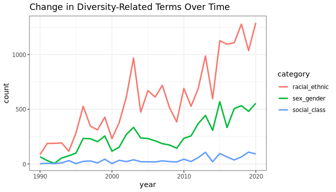

# diverstidy: A tidy package for detection and standardization of geographic, population, and diversity-related terminology in unstructured text data 

**Authors:** [Brandon Kramer](https://www.brandonleekramer.com/)<br/>
**License:** [MIT](https://opensource.org/licenses/MIT)<br/>

<!-- badges: start -->

<!--[](https://github.com/brandonleekramer/diverstidy/actions) -->

<!-- badges: end -->

### Installation

You can install this package using the `devtools` package:

``` r
install.packages("devtools")
devtools::install_github("brandonleekramer/diverstidy") 
```

The `diverstidy` package provides several functions that help detect
patterns in unstandardized text data for analyses of geographies,
populations, other forms of diversity. Currently, there are 17 different
functions that detect terms across the following subdomains of
diversity-related research: ancestry, culture, disability,
discrimination, diversity, equity, inclusion, linguistic, migration,
population, race/ethnicity, religious, sex/gender, sexuality, social
class, and US OMB population terms. Although somewhat simple, the
intuition behind these functions is to detect the quantity of
diversity-related terms show up in a given text entry. To do this, each
function depends on a curated dictionary of terms that fall under these
17 domains of topics, which can be called using the
`data(diversity_dictionary)` function. There are a number of case
studies, but the primary uses of these functions are to examine
historical trends in term usage and/or to detect potential biases in
text.

### Analyzing historical trends with `detect_*_terms()`

These functions help users quickly analyze changes in terms over time
using one of the seventeen dictionaries available on diversity-related
topics.

``` r
library(tidyverse)
library(diverstidy)
data(pubmed_data)
```

``` r
pubmed_data %>%
  detect_racialethnic_terms(fk_pmid, abstract) %>%
  detect_sexgender_terms(fk_pmid, abstract) %>% 
  detect_socialclass_terms(fk_pmid, abstract) %>% 
  group_by(year) %>% 
  summarize(racial_ethnic = sum(racial_ethnic),
            sex_gender = sum(sex_gender),
            social_class = sum(social_class)) %>% 
  pivot_longer(!year, names_to = "category", values_to = "count") %>% 
  ggplot(aes(x=year, y=count, group=category)) +
  geom_line(aes(color=category), size = 1) +
  ggtitle("Change in Diversity-Related Terms Over Time") + theme_bw() 
```



### Examine relationships between diversity terminology within texts

Combine the `diverstidy` package with `tidytext` and `tidygraph` to make
text networks.

``` r
library(tidyverse)
library(diverstidy)
library(tidytext)
library(igraph)
library(ggraph)
library(tidygraph)
data(pubmed_data)
data(diversity_dictionary)
```

``` r
# create an edgelist of all terms mentioned more than 100 times together 
pubmed_graph <- pubmed_data %>%
  unnest_tokens(bigram, abstract, token = "ngrams", n = 2) %>%
  separate(bigram, c("word1", "word2"), sep = " ") %>% 
  count(word1, word2, sort = TRUE) %>%
  filter(n > 100) %>%
  graph_from_data_frame() 

# pull out the nodelist from that graph 
nodelist <- data.frame(id = c(1:(igraph::vcount(pubmed_graph))), 
                       name = igraph::V(pubmed_graph)$name)
# and join category data to all our diversity terms 
dictionary_terms <- diversity_dictionary %>% 
  unnest_legacy(name = strsplit(catch_terms, "\\|")) %>% 
  select(name, category)
nodelist <- nodelist %>% 
  left_join(dictionary_terms, by = "name") %>% 
  mutate(category = replace_na(category, "nothing"),
         category = str_replace(category, "race/ethnicity\\|us omb terms", "us omb terms"))
V(pubmed_graph)$category <- nodelist$category

# create a custom color palette and vector to only visualize certain words 
custom_colors <- colorRampPalette(c("#D3D3D3", RColorBrewer::brewer.pal(9, 'Spectral')))
graph_tbl <- pubmed_graph %>% 
  as_tbl_graph() %>% 
  activate(nodes) %>% 
  mutate(degree  = centrality_degree()) %>% 
  mutate(new_name = ifelse(str_detect(
    name, str_c("\\b(?i)(",paste0(dictionary_terms$name, collapse = "|"),")\\b")), name, no = ""))

# graph a text network of all our dictionary terms 
layout <- create_layout(graph_tbl, layout = 'igraph', algorithm = 'nicely')
ggraph(layout) +
  geom_edge_fan(aes(alpha = ..index..), show.legend = F) + 
  geom_node_point(aes(size = degree, color = as.factor(category)), show.legend = F) +
  geom_node_text(aes(label = new_name), vjust = 1, hjust = 1) +
  scale_color_manual(limits = as.factor(layout$category), 
                     values = custom_colors(nrow(layout))) +  theme_void()
```


